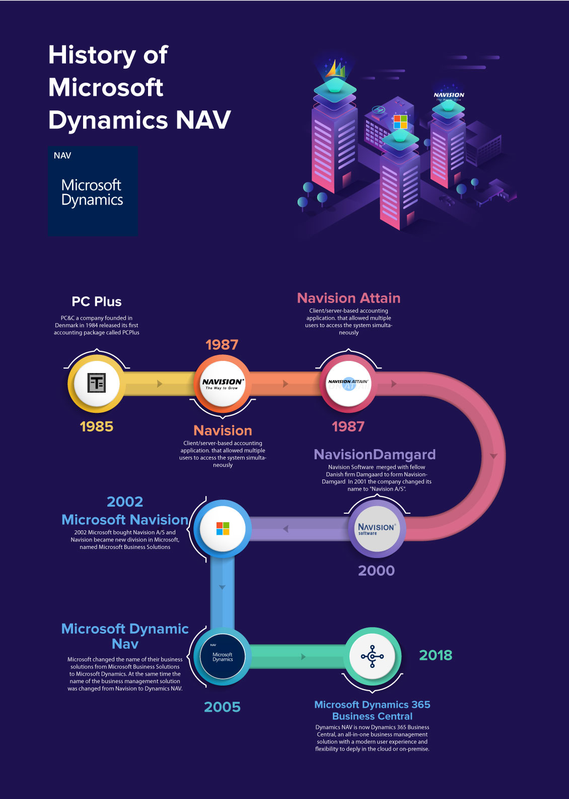

# About

With 10 years of experience in software development, my journey in the tech world has been deeply intertwined with Microsoft Dynamics 365 Business Central and Dynamics NAV. Over the years, I've honed my skills as a Technical Consultant, gaining in-depth knowledge and hands-on experience in various aspects of ERP systems, particularly in Distribution Management Systems (DMS).

Recognizing the growing importance of artificial intelligence and machine learning in the technology landscape, I have embarked on a dedicated learning journey to expand my expertise in these areas.

# Microsoft Dynamics 365 Business Central

https://dynamics.microsoft.com/en-us/business-central/overview/

**Microsoft Dynamics 365 Business Central** (formerly known as **Microsoft NAV** and before that, it was **Navision**) is an Enterprise Resource Planing solution for managing all business processes, and part of Microsoft’s Dynamics 365 range of business applications. It gives a single, end-to end solution for managing finances, operations, sales and customer service, and an opportunity to easily upgrade from entry-level accounting software and legacy [ERP systems](https://www.the365people.com/enterprise-resource-planning).

## From Navision to Microsoft Dynamics 365 Business Central

Navision, a Danish software company founded in 1984, created an ERP (Enterprise Resource Planning) solution known as Navision Financials. This platform offered comprehensive financial and operational management for businesses. Over time, Navision evolved its product lineup, incorporating functionalities beyond finance, like supply chain management and CRM, becoming known as Navision Attain.

In 2002, Microsoft acquired Navision and merged it with another acquired ERP solution, Great Plains Software, to form Microsoft Business Solutions. This merger resulted in the birth of Microsoft Dynamics NAV, combining the strengths of Navision and Great Plains.

The Dynamics NAV platform continued to evolve, incorporating enhancements, features, and improved integrations. Microsoft's aim was to streamline business processes, enhance user experience, and expand the capabilities of the software.

Fast forward to 2018 when Microsoft rebranded and launched Dynamics 365 Business Central. It marked a significant shift as Business Central became a part of the Dynamics 365 suite, offering a cloud-based, all-in-one ERP solution designed for small to medium-sized businesses. While it's based on the foundation of Dynamics NAV, Business Central offers modernized features, improved user interfaces, and cloud-based accessibility, aligning with Microsoft's vision for a connected and agile business ecosystem.

## Customization

Dynamics 365 Business Central offers a high degree of customization through its programming language. Users can tailor the platform to fit their specific business needs by adding or modifying fields, creating custom applications, workflows, and reports. This flexibility enables businesses to adapt the software to match their unique processes and requirements without extensive coding knowledge.

## Hosting

1. **Cloud**: Microsoft hosts Business Central in the cloud (Software as a Service - SaaS), providing easy access, automatic updates, scalability, and reduced infrastructure costs.
2. **On-Premises**: Some businesses prefer hosting Business Central on their own servers, allowing them to have more control over data and customization. This requires managing the infrastructure and updates internally.

