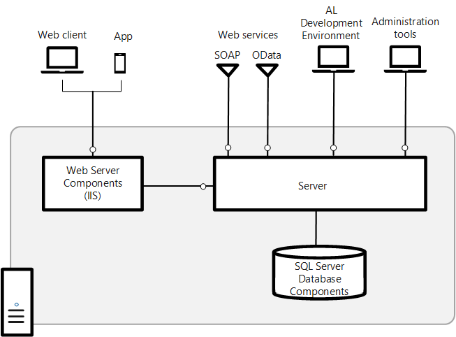

# Microsoft Dynamics 365 Business Central Architecture

## Architecture

Here is diagram of Dynamics 365 Business Central Architecture

## Main Components

| Component  | Description |
| ------------- | ------------- |
| SQL Database | A SQL database (SQL Server, SQL Server on Azure VM, Azure SQL Managed Instance, or Azure SQL Database) that contains application object definitions and business data.|
| Server | Business Central Server is a .NET-based Microsoft service that uses Windows Communication Framework to handle communications between clients and databases. It controls authentication, event logging, scheduled tasks, reporting and more |
| Web Server | An Internet Information Server (IIS) web site, provisioned with the Business Central Web Server components, that enables access from the Business Central Web client and mobile apps. |
| Business Central App | A desktop, phone, and tablet app for Business Central.|
| Web services| SOAP and OData Web Services for exposing application functionality to external systems and users. Developers can create and publish functionality as web services. They expose pages, codeunits, or queries, and even enhance a page web service by using an extension codeunit.|

## Development and administration components

| Component  | Second Header |
| ------------- | ------------- |
| AL development environment | An AL language extension for Visual Studio Code for developing application and extensions.|
| Business Central Administration Shell | Windows PowerShell modules for managing the deployment, including tasks such adding and configuring Business Central Server and Web server instances, databases, and users, and administering extension packages.|
| Business Central Server Administration tool | A Microsoft Management Console (MMC) for creating and configuring Business Central Server instances. |
