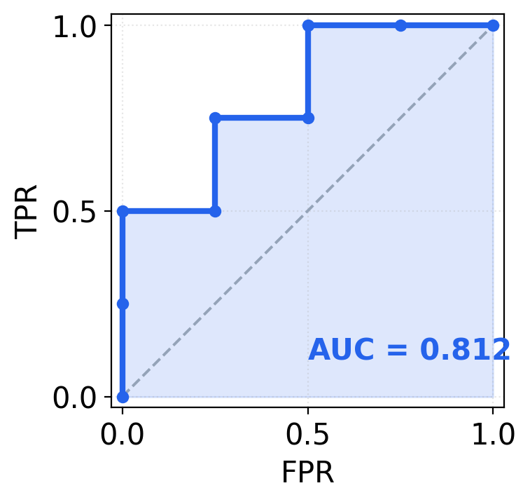
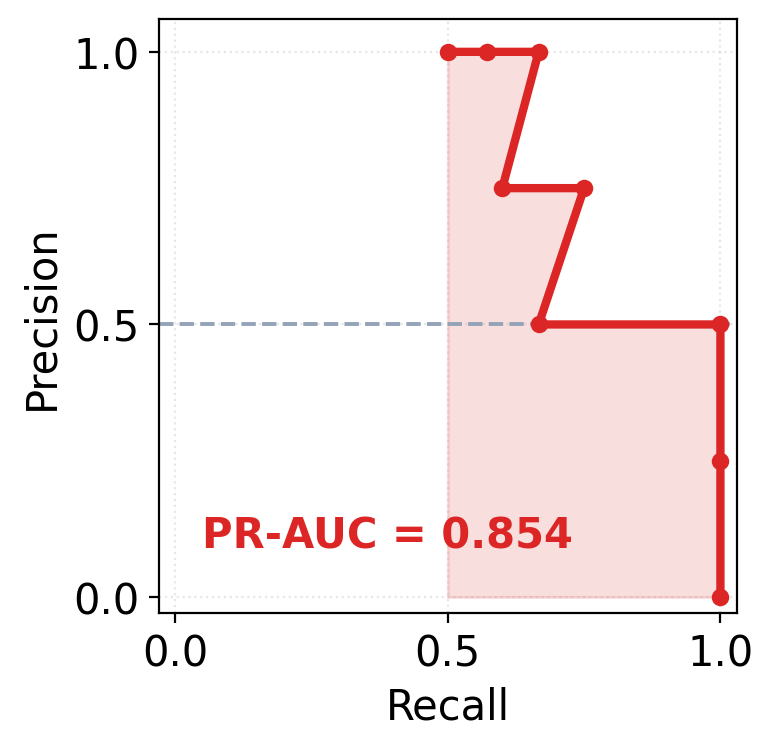
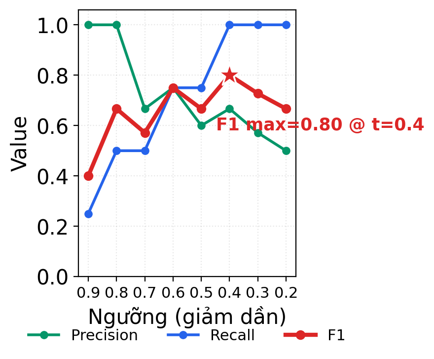
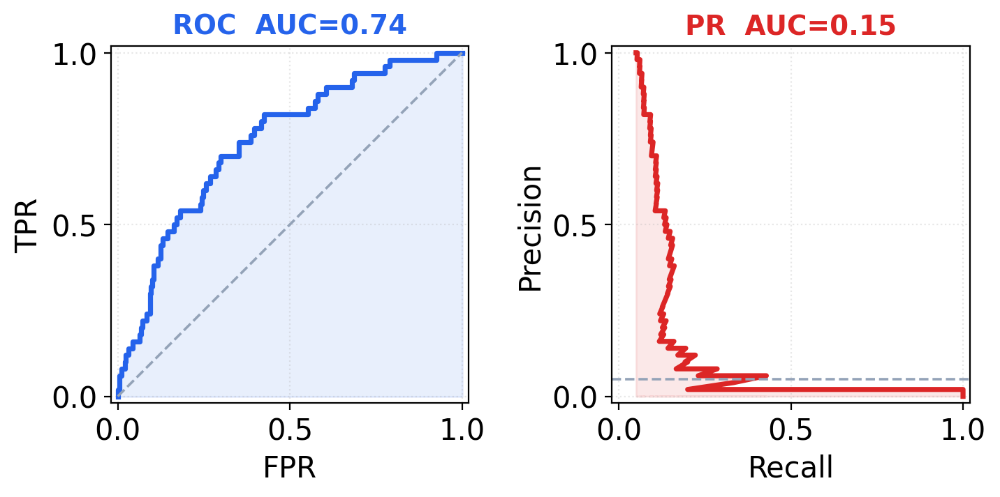

# Classification Metrics

Mọi metric phân loại nhị phân đều sinh ra từ đúng **bốn con số của confusion matrix** — chúng chỉ tổ hợp bốn con số đó theo cách khác nhau, và mỗi cách trả lời một câu hỏi riêng. Note này đi từ confusion matrix, rồi lần lượt dựng từng metric lên trên nó: Accuracy → Precision → Recall → FPR → F1 → ROC-AUC → PR-AUC. Hiểu rõ "cách tổ hợp" là hiểu vì sao trên cùng một model, các metric có thể kể những câu chuyện rất khác nhau.

## 1. Nền của mọi thứ — Confusion Matrix

Với bài toán phân loại nhị phân, mỗi dự đoán rơi vào một trong bốn ô:

|                    | Thực tế Dương        | Thực tế Âm           |
|--------------------|----------------------|----------------------|
| **Dự đoán Dương**  | TP (bắt đúng)        | FP (báo nhầm)        |
| **Dự đoán Âm**     | FN (bỏ sót)          | TN (loại đúng)       |

- **TP** (True Positive): ca dương, model nói dương → đúng.
- **FP** (False Positive): ca âm, model nói dương → báo nhầm (false alarm).
- **FN** (False Negative): ca dương, model nói âm → bỏ sót (miss).
- **TN** (True Negative): ca âm, model nói âm → đúng.

Hai quy ước đọc số quan trọng:

- **Quy tắc mẫu số:** mỗi "rate" chia cho một *hàng thực tế* đầy đủ của nó (toàn bộ ca dương thật, hoặc toàn bộ ca âm thật). Vì mẫu số là hằng số, các rate này bền vững khi lớp bị mất cân bằng.
- **Confusion matrix phụ thuộc ngưỡng.** Model cho ra *điểm* (xác suất); phải chọn một ngưỡng (mặc định 0.5) để biến điểm thành nhãn 0/1. Đổi ngưỡng → bốn con số đổi → mọi metric tính từ nhãn cũng đổi.

## 2. Accuracy — và vì sao nó đánh lừa

```
Accuracy = (TP + TN) / (TP + TN + FP + FN)
```

Tỷ lệ dự đoán đúng trên toàn bộ. Trực giác, dễ hiểu — nhưng **sập bẫy khi dữ liệu mất cân bằng**: với 99% lớp âm, model đoán "tất cả là âm" đạt accuracy 99% mà recall lớp dương = 0, hoàn toàn vô dụng. Accuracy gộp chung TP và TN, nên lớp đa số (thường là TN) chi phối con số.

→ Dùng accuracy chỉ khi hai lớp **cân bằng** và chi phí FP ≈ chi phí FN. Ngoài ra, chuyển sang các metric bên dưới. Xem thêm [Class Imbalance & Distribution Shift](L03-data-imbalance-shift.md).

## 3. Precision — độ tin khi model báo dương

```
Precision = TP / (TP + FP)
```

Trong tất cả các ca model **báo dương**, bao nhiêu phần là đúng. Mẫu số `TP + FP` = tổng số lần báo-dương — con số này *thay đổi* theo ngưỡng và theo tỷ lệ lớp. Precision cao = ít làm phiền bằng cảnh báo sai. Quan trọng khi **chi phí FP lớn** (gắn cờ nhầm giao dịch của khách VIP, lọc nhầm email quan trọng vào spam).

## 4. Recall (= TPR) — bắt được bao nhiêu ca dương

```
Recall = TPR = TP / (TP + FN)
```

Trong tất cả các ca **dương thật**, model bắt được bao nhiêu phần. Mẫu số `TP + FN` = tổng số ca dương thật (hằng số, không đổi khi chỉnh ngưỡng). Recall cao = ít bỏ sót. Quan trọng khi **chi phí FN lớn** (bỏ sót ca ung thư, bỏ sót gian lận).

Machine learning quen gọi **Recall**; thống kê / ROC quen gọi **TPR** (True Positive Rate) — **cùng một con số, khác tên gọi**, và ROC dùng nó cặp với FPR.

**Precision ↔ Recall căng nhau:** hạ ngưỡng để bắt thêm ca dương (recall ↑) thì kéo theo nhiều báo nhầm (precision ↓), và ngược lại. Không có bữa trưa miễn phí — phải chọn điểm cân bằng theo nghiệp vụ.

## 5. FPR — tỷ lệ báo động giả trên lớp âm

```
FPR = FP / (FP + TN)
```

Trong tất cả các ca **âm thật**, bao nhiêu phần bị báo nhầm thành dương. Mẫu số `FP + TN` = tổng số ca âm thật (hằng số). FPR là "cặp đôi" của TPR trong không gian ROC.

### Điểm neo để nhớ

Recall, TPR, Precision đều lấy **TP ở tử số**; chỉ FPR lấy **FP ở tử số**. Recall và TPR y hệt nhau. Khác biệt cốt lõi Precision ↔ TPR nằm ở **mẫu số**: Precision chia cho *pool báo-dương cục bộ* (thay đổi), TPR chia cho *toàn bộ lớp âm* (hằng số). Đây là gốc rễ của mọi khác biệt ROC ↔ PR ở §8.

## 6. F1 — gộp Precision & Recall tại một ngưỡng

```
F1 = 2 · (P · R) / (P + R)
```

F1 là **trung bình điều hòa** (harmonic mean) của Precision và Recall, không phải trung bình cộng. Hệ quả: F1 bị kéo về phía con số nhỏ hơn — chỉ cần P hoặc R thấp là F1 sập, không "ăn gian" được bằng cách đẩy một vế lên thật cao.

Ví dụ lệch cực đại: P = 1.0, R = 0.0
- Trung bình cộng → 0.50 (nghe ổn nhưng vô nghĩa)
- Trung bình điều hòa → 0.00 (đúng bản chất: model này vô dụng)

F1 **bỏ qua TN** → tập trung hoàn toàn vào lớp dương, nhờ vậy tránh được cái bẫy accuracy khi dữ liệu mất cân bằng.

**F-beta:** nếu FN và FP không đắt ngang nhau, dùng `F_β = (1+β²)·P·R / (β²·P + R)`. `β > 1` ưu tiên recall (bỏ sót đắt hơn), `β < 1` ưu tiên precision.

**Quan trọng:** F1 tính tại **một ngưỡng cụ thể**. Đổi ngưỡng → P, R đổi → F1 đổi. Hai metric tiếp theo thì tổng hợp trên *mọi* ngưỡng.

## 7. ROC-AUC — chất lượng xếp hạng, không phụ thuộc ngưỡng

**Đường ROC**: quét ngưỡng từ cao xuống thấp, mỗi ngưỡng cho một điểm `(FPR, TPR)`. Đường là hàm bậc thang: gặp một ca dương → bước *lên*, gặp một ca âm → bước *sang phải*. **ROC-AUC = diện tích dưới đường này.**

Diễn giải nên thuộc: bốc ngẫu nhiên một cặp (một ca dương, một ca âm) → **ROC-AUC là xác suất model chấm điểm ca dương cao hơn ca âm**. 0.5 = đoán bừa, 1.0 = hoàn hảo. Vì chỉ đo *thứ tự xếp hạng*, ROC-AUC **không phụ thuộc ngưỡng** và **bất biến với tỷ lệ lớp**.

{width=360}

## 8. PR-AUC — độ "tinh khiết" của các cảnh báo dương

**Đường PR**: trục ngang Recall, trục dọc Precision. Cũng quét ngưỡng, nhưng đường "nhấp nhô" chứ không đơn điệu — Precision có thể tụt rồi lại lên khi thêm một TP. **PR-AUC (average precision) = diện tích dưới đường này.**

Diễn giải: nhìn từ mỗi mức điểm trở lên, nhóm điểm cao đó có "sạch" (ít lẫn ca âm) không? Lấy trung bình trên mọi mức. Trả lời: *khi model kêu to, có tin được không, và tin được bao nhiêu?*

{width=360}

### Ví dụ: cùng một tập dự đoán, ba góc nhìn

Với 8 mẫu, cùng một model có thể ra **ROC-AUC ≈ 0.81, PR-AUC ≈ 0.85, F1 max ≈ 0.80** tại ngưỡng ≈ 0.4. Đường F1 theo ngưỡng thường có *đỉnh* — đây chính là lý do đi tìm `best_threshold` thay vì cứng nhắc dùng 0.5.

{width=420}

## 9. Vì sao ROC ≠ PR

|      | Trục ngang            | Trục dọc              | Góc "đẹp"    |
|------|-----------------------|-----------------------|--------------|
| ROC  | FPR (thấp → bên trái) | TPR (cao → lên trên)  | trên–trái    |
| PR   | Recall (cao → phải)   | Precision (cao → lên) | trên–phải    |

Chính **mẫu số của FP** quyết định tất cả:

- **ROC**: FP chia cho *toàn bộ lớp âm N* (hằng số khổng lồ khi lớp âm áp đảo). Mỗi FP chỉ đẩy FPR lên `1/N` → đường ROC vẫn "trông đẹp" dù model sai nhiều.
- **PR**: FP chia cho *pool báo-dương cục bộ* (nhỏ). Thêm vài FP là Precision tụt ngay → đường PR phản ánh sự thật khắc nghiệt hơn.

Hệ quả: với dữ liệu mất cân bằng nặng (ví dụ 5% dương), cùng một model có thể cho **ROC-AUC = 0.74 nhưng PR-AUC chỉ = 0.15**. Khi lớp dương hiếm và ta quan tâm chất lượng cảnh báo dương → **dùng PR-AUC**.

{width=620}

## 10. Đọc thế nào là tốt / xấu

Chỉ ROC-AUC có baseline cố định 0.5. Baseline của F1 và PR-AUC *trôi theo prevalence* (tỷ lệ lớp dương) — **đừng bao giờ so hai giá trị này giữa hai tập có tỷ lệ lớp khác nhau**.

| Metric   | Phụ thuộc ngưỡng? | Baseline "vô dụng"      | Nhạy với prevalence? | Trả lời câu hỏi                                  |
|----------|-------------------|------------------------|----------------------|-------------------------------------------------|
| Accuracy | Có (một ngưỡng)   | tỷ lệ lớp đa số        | Có                   | Đoán đúng bao nhiêu phần? (chỉ khi cân bằng)    |
| Precision| Có (một ngưỡng)   | = prevalence           | Có                   | Báo dương thì tin được bao nhiêu?              |
| Recall   | Có (một ngưỡng)   | phụ thuộc ngưỡng       | Không                | Bắt được bao nhiêu phần ca dương?             |
| F1       | Có (một ngưỡng)   | 2·prev / (1 + prev)    | Có                   | Cân bằng P–R tại điểm vận hành có tốt không?   |
| ROC-AUC  | Không (mọi ngưỡng)| 0.5 (cố định)          | Không                | Xếp hạng ca dương trên ca âm có giỏi không?    |
| PR-AUC   | Không (mọi ngưỡng)| = prevalence           | Có                   | Nhóm điểm cao có "sạch" không?                 |

**Quy tắc vàng:** đừng hỏi "0.6 là tốt hay xấu?" theo số tuyệt đối. Hỏi: *"cao hơn baseline trên CÙNG tập này bao nhiêu?"* — prevalence 50% thì F1 baseline đã là 0.667; prevalence 1% thì baseline chỉ 0.02.

## 11. Chọn metric nào khi nào

- **Lớp cân bằng, chi phí FP ≈ FN:** Accuracy đủ dùng.
- **Lớp cân bằng, cần một con số so sánh model:** ROC-AUC.
- **Lớp dương hiếm (gian lận, bệnh hiếm, anomaly), quan tâm chất lượng cảnh báo:** PR-AUC.
- **Đã chốt ngưỡng, cần báo cáo hiệu năng vận hành:** F1 (hoặc precision/recall riêng lẻ).
- **Chi phí FP ≠ chi phí FN rõ rệt:** F-beta, hoặc xét thẳng precision–recall theo yêu cầu nghiệp vụ, hoặc cost-sensitive threshold.

## 12. Những hiểu lầm thường gặp

- **"Accuracy 95% là model tốt":** vô nghĩa nếu không biết prevalence — lớp đa số 95% thì đoán bừa cũng được 95%.
- **"ROC-AUC cao nghĩa là model tốt để deploy":** không hẳn. ROC-AUC chỉ nói khả năng *xếp hạng*. Với lớp mất cân bằng, ROC-AUC 0.9 vẫn có thể đi kèm PR-AUC thấp và precision tệ tại mọi ngưỡng dùng được.
- **So F1 (hoặc PR-AUC) giữa hai dataset khác prevalence:** vô nghĩa, vì baseline khác nhau.
- **Nghĩ Precision và Recall đối xứng nhau:** không. Recall có mẫu số hằng số (toàn lớp dương), Precision có mẫu số thay đổi (pool báo-dương).
- **Dùng ngưỡng 0.5 mặc định rồi báo F1:** F1 phụ thuộc ngưỡng; nên quét ngưỡng tìm đỉnh F1 (hoặc chọn theo ràng buộc nghiệp vụ) trên tập validation / OOF train trước khi báo cáo — xem [L04](L04-data-leakage-validation.md).
- **Recall ≠ TPR:** sai — chúng là **cùng một con số**, chỉ khác tên gọi.

## 13. Tóm tắt

- Bốn số **TP / FP / FN / TN** là gốc; mọi metric chỉ là cách tổ hợp khác nhau; tất cả (trừ ROC-AUC, PR-AUC) phụ thuộc ngưỡng.
- **Accuracy** = (TP+TN)/tất cả — chỉ dùng khi cân bằng.
- **Precision** = TP/(TP+FP) — tin được bao nhiêu khi báo dương; nhạy FP.
- **Recall = TPR** = TP/(TP+FN) — bắt được bao nhiêu ca dương; nhạy FN.
- **FPR** = FP/(FP+TN) — báo động giả trên lớp âm; cặp với TPR trong ROC.
- **F1** = trung bình điều hòa của P và R tại **một ngưỡng**; bỏ qua TN; baseline = 2·prev/(1+prev).
- **ROC-AUC** = xác suất xếp đúng một cặp dương–âm; baseline cố định 0.5; bất biến tỷ lệ lớp.
- **PR-AUC** = độ "tinh khiết" trung bình của các nhóm điểm cao; baseline = prevalence; nhạy tỷ lệ lớp → ưu tiên khi lớp dương hiếm.
- Khác biệt ROC ↔ PR nằm ở mẫu số của FP: toàn lớp âm (hằng số) so với pool báo-dương (cục bộ).
- Luôn đọc metric tương đối so với baseline trên *cùng* tập dữ liệu.
