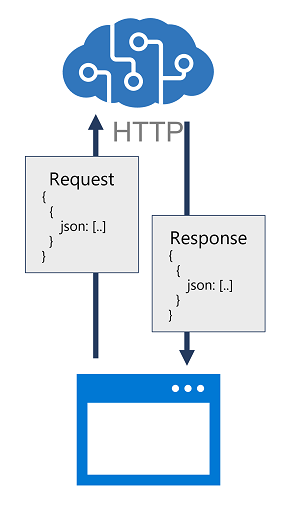
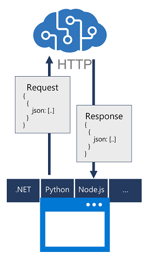

# Introduction

Azure AI services are cloud-based services that encapsulate AI capabilities. Rather than a single product, you should think of AI services as a set of individual services that you can use as building blocks to compose sophisticated, intelligent applications.

While the details of each AI service can vary, the approach to provisioning and consuming them is generally the same.

- Create Azure AI services resources in an Azure subscription.

- Identify endpoints, keys, and locations required to consume an AI services resource.

- Use a REST API to consume an AI service.

- Use an SDK to consume an AI service.

# Identify endpoints and keys

To consume the service through the endpoint, applications require the following information:

**The endpoint URI**. This is the HTTP address at which the REST interface for the service can be accessed. Most AI services software development kits (SDKs) use the endpoint URI to initiate a connection to the endpoint.

**A subscription key**. Access to the endpoint is restricted based on a subscription key. Client applications must provide a valid key to consume the service. When you provision an AI services resource, two keys are created - applications can use either key. You can also regenerate the keys as required to control access to your resource.

**The resource location**. When you provision a resource in Azure, you generally assign it to a location, which determines the Azure data center in which the resource is defined. While most SDKs use the endpoint URI to connect to the service, some require the location.

# Use a REST API

Azure AI services provide REST application programming interfaces (APIs) that client applications can use to consume services. In most cases, service functions can be called by submitting data in JSON format over an HTTP request, which may be a POST, PUT, or GET request depending on the specific function being called. The results of the function are returned to the client as an HTTP response, often with JSON contents that encapsulate the output data from the function.

# Use an SDK

You can develop an application that uses Azure AI services using REST interfaces, but it's easier to build more complex solutions by using native libraries for the programming language in which you're developing the application.

Software development kits (SDKs) for common programming languages abstract the REST interfaces for most AI services. SDK availability varies by individual AI services, but for most services there's an SDK for languages such as:

- Microsoft C# (.NET Core)

- Python

- JavaScript (Node.js)

- Go

- Java

Each SDK includes packages that you can install in order to use service-specific libraries in your code, and online documentation to help you determine the appropriate classes, methods, and parameters used to work with the service.