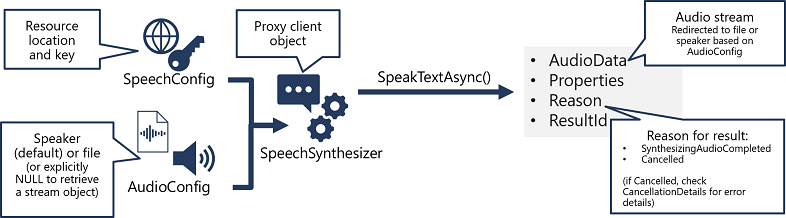
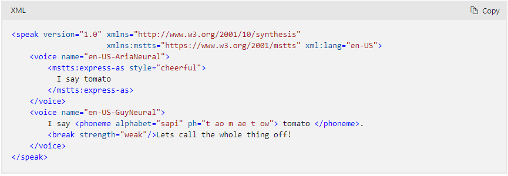
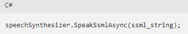
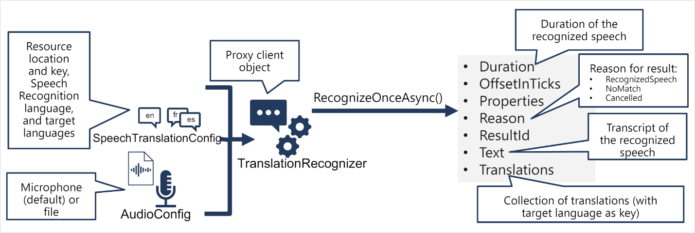

# Azure AI Speech service

Created by: thanh quang le nhut
Created time: January 2, 2024 10:43 AM

# Azure AI Speech services

Azure AI Speech provides APIs that you can use to build speech-enabled applications. This includes:

- Speech to text: An API that enables speech recognition in which your application can accept spoken input.
- Text to speech: An API that enables speech synthesis in which your application can provide spoken output.
- Speech Translation: An API that you can use to translate spoken input into multiple languages.
- Speaker Recognition: An API that enables your application to recognize individual speakers based on their voice.
- Intent Recognition: An API that uses conversational language understanding to determine the semantic meaning of spoken input.

## Speech to text


**AudioConfig** represents audio input or output configuration. Audio input can be from a microphone, file, or input stream. Audio output can be to a speaker, audio file output as WAV format, or output stream.

**SpeedRecognizer** transcribes speech into text.

## Text to speech



**SpeechSynthesizer** performs speech synthesis to speaker, file, or other audio output streams.

## Speech Synthesis Markup Language

While the Azure AI Speech SDK enables you to submit plain text to be synthesized into speech (for example, by using the SpeakTextAsync() method), the service also supports an XML-based syntax for describing characteristics of the speech you want to generate. This Speech Synthesis Markup Language (SSML) syntax offers greater control over how the spoken output sounds, enabling you to:

- Specify a speaking style, such as "excited" or "cheerful" when using a neural voice.
- Insert pauses or silence.
- Specify phonemes (phonetic pronunciations), for example to pronounce the text "SQL" as "sequel".
- Adjust the prosody of the voice (affecting the pitch, timbre, and speaking rate).
- Use common "say-as" rules, for example to specify that a given string should be expressed as a date, time, telephone number, or other form.
- Insert recorded speech or audio, for example to include a standard recorded message or simulate background noise.

For example, consider the following SSML:



To submit an SSML description to the Speech service, you can use the SpeakSsmlAsync() method, like this:



## Translate speech with the Azure AI Speech service

The pattern for speech translation using the Azure AI Speech SDK is similar to speech recognition, with the addition of information about the source and target languages for translation:



# Using C# SDK

dotnet add package Microsoft.CognitiveServices.Speech --version 1.30.0

```C#
using System;
using System.Media;
using System.Threading.Tasks;
using Microsoft.CognitiveServices.Speech;
using Microsoft.CognitiveServices.Speech.Audio;
using Microsoft.Extensions.Configuration;

// Import namespaces

namespace speaking_clock
{
    class Program
    {
        private static SpeechConfig speechConfig;
        static async Task Main(string[] args)
        {
            try
            {
                // Get config settings from AppSettings
                IConfigurationBuilder builder = new ConfigurationBuilder().AddJsonFile("appsettings.json");
                IConfigurationRoot configuration = builder.Build();
                string aiSvcKey = configuration["SpeechKey"];
                string aiSvcRegion = configuration["SpeechRegion"];

                // Configure speech service
                speechConfig = SpeechConfig.FromSubscription(aiSvcKey, aiSvcRegion);
                

                // Get spoken input
                string command = "";
                command = await TranscribeCommand();
                if (command.ToLower()=="what time is it?")
                {
                    await TellTime();
                }

            }
            catch (Exception ex)
            {
                Console.WriteLine(ex.Message);
            }
        }

        static async Task<string> TranscribeCommand()
        {
            string command = "";

            // Configure speech recognition

            // Using audio file
            string audioFile = "time.wav";
            SoundPlayer wavPlayer = new SoundPlayer(audioFile);
            wavPlayer.Play();
            using AudioConfig audioConfig = AudioConfig.FromWavFileInput(audioFile);

            // Using microphone
            //using AudioConfig audioConfig = AudioConfig.FromDefaultMicrophoneInput();
            //Console.WriteLine("Speak now...");
            using SpeechRecognizer speechRecognizer = new SpeechRecognizer(speechConfig, audioConfig);

            // Process speech input
            SpeechRecognitionResult speech = await speechRecognizer.RecognizeOnceAsync();
            if (speech.Reason == ResultReason.RecognizedSpeech)
            {
                command = speech.Text;
                Console.WriteLine(command);
            }
            else
            {
                Console.WriteLine(speech.Reason);
                if (speech.Reason == ResultReason.Canceled)
                {
                    var cancellation = CancellationDetails.FromResult(speech);
                    Console.WriteLine(cancellation.Reason);
                    Console.WriteLine(cancellation.ErrorDetails);
                }
            }

            // Return the command
            return command;
        }

        static async Task TellTime()
        {
            var now = DateTime.Now;
            string responseText = "The time is " + now.Hour.ToString() + ":" + now.Minute.ToString("D2");

            // Configure speech synthesis
            speechConfig.SpeechSynthesisVoiceName = "en-GB-RyanNeural";
            //speechConfig.SpeechSynthesisVoiceName = "en-GB-LibbyNeural"; 
            using SpeechSynthesizer speechSynthesizer = new SpeechSynthesizer(speechConfig);

            // Synthesize spoken output
            SpeechSynthesisResult speak = await speechSynthesizer.SpeakTextAsync(responseText);
            if (speak.Reason != ResultReason.SynthesizingAudioCompleted)
            {
                Console.WriteLine(speak.Reason);
            }

            // Print the response
            Console.WriteLine(responseText);
        }

    }
}
```