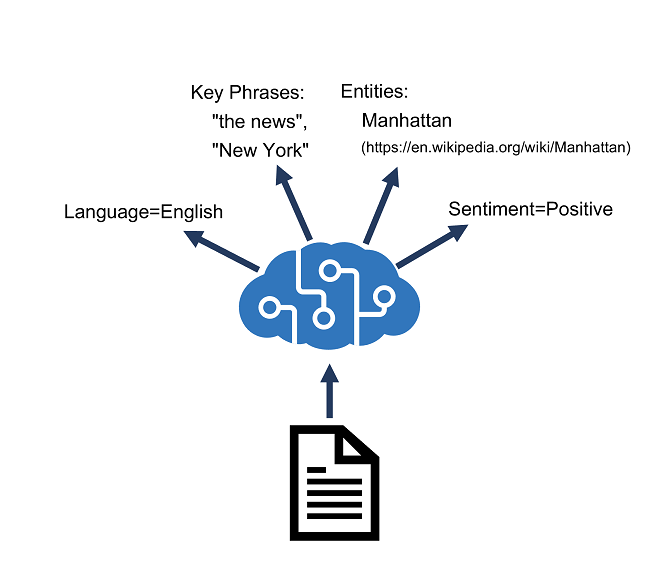

# Process and translate text with Azure AI Services

The Azure AI Language service is designed to help you extract information from text. It provides functionality that you can use for:

- Language detection - determining the language in which text is written.
- Key phrase extraction - identifying important words and phrases in the text that indicate the main points.
- Sentiment analysis - quantifying how positive or negative the text is.
- Named entity recognition - detecting references to entities, including people, locations, time periods, organizations, and more.
- Entity linking - identifying specific entities by providing reference links to Wikipedia articles.



After you have provisioned a suitable resource in your Azure subscription, you can use its **endpoint** and one of **its subscription keys** to call the Azure AI Language APIs from your code. You can call the Azure AI Language APIs by submitting requests in JSON format to the REST interface, or by using any of the available programming language-specific SDKs.

## Azure AI Language APIs

When using APIs, the JSON requests and responses exchanged with the REST interface.

### Detect language

Evaluates text input, for each document submitted, return language identifiers with a score indicating the strength of the analysis.

The Azure AI Language service recognizes up to 120 languages.

A sample of a properly formatted JSON payload that you might submit to the service in the request body is shown here, including a collection of documents, each containing a unique id and the text to be analyzed.

The service will return a JSON response that contains a result for each document in the request body, including the predicted language and a value indicating the confidence level of the prediction.

### Extract key phrases

Extract key phrases is the process of evaluating the text of a document, or documents, and then identifying the main points around the context of document(s).

The response contains a list of key phrases detected in each document

### Analyze sentiment

Sentiment analysis is used to how positive or negative a text document is.

The response of the service might look like this:

### Extract entities

Named Entity Recognition identifies entities that are mentioned in the text.

Input for entity recognition is similar to input for other Azure AI Language API functions:

The response includes a list of categorized entities found in each document:

### Extract linked entities

## Azure AI Language SDKs

When using an SDK, the JSON requests are abstracted by appropriate objects and methods that encapsulate the same data values.

### C#

dotnet add package Azure.AI.TextAnalytics --version 5.3.0

```C#
using System;
using System.IO;
using System.Text;
using Microsoft.Extensions.Configuration;
// Import namespaces
using Azure;
using Azure.AI.TextAnalytics;

namespace text_analysis
{
    class Program
    {
        static void Main(string[] args)
        {
            try
            {
                // Get config settings from AppSettings
                IConfigurationBuilder builder = new ConfigurationBuilder().AddJsonFile("appsettings.json");
                IConfigurationRoot configuration = builder.Build();
                string svcEndpoint = configuration["AIServicesEndpoint"];
                string svcKey = configuration["AIServicesKey"];

                // Create client using endpoint and key
                AzureKeyCredential credentials = new AzureKeyCredential(svcKey);
                Uri endpoint = new Uri(svcEndpoint);
                TextAnalyticsClient textAnalyticsClient = new TextAnalyticsClient(endpoint,credentials);

                // Analyze each text file in the reviews folder
                var folderPath = Path.GetFullPath("./reviews");
                DirectoryInfo folder = new DirectoryInfo(folderPath);
                foreach(var file in folder.GetFiles("*.txt"))
                {
                    Console.WriteLine("=================================================");
                    Console.WriteLine(file.Name);
                    StreamReader r = file.OpenText();
                    var text = r.ReadToEnd();
                    
                
                    // Get language
                    Console.WriteLine("DETECT LANGUAGE");
                    DetectedLanguage detectedLanguage = textAnalyticsClient.DetectLanguage(text);
                    Console.WriteLine($"Language: {detectedLanguage.Name}");

                    // Get sentiment
                    DocumentSentiment documentSentiment = textAnalyticsClient.AnalyzeSentiment(text);
                    Console.WriteLine($"Sentiments: {documentSentiment.Sentiment}");
                    
                    // Get key phrases
                    KeyPhraseCollection phrases = textAnalyticsClient.ExtractKeyPhrases(text);
                    foreach(var phrase in phrases)
                    {
                        Console.WriteLine($"{phrase}");
                    }

                    // Get entities
                    CategorizedEntityCollection entities = textAnalyticsClient.RecognizeEntities(text);
                    foreach(var entity in entities) 
                    {
                        Console.WriteLine($"{entity.Text} - {entity.Category} - {entity.ConfidenceScore}");
                    }

                    // Get linked entities
                    LinkedEntityCollection linkedEntities = textAnalyticsClient.RecognizeLinkedEntities(text);
                    if (linkedEntities.Count > 0)
                    {
                        Console.WriteLine("\nLinks:");
                        foreach (LinkedEntity linkedEntity in linkedEntities)
                        {
                            Console.WriteLine($"\t{linkedEntity.Name} ({linkedEntity.Url})");
                        }
                    }
                }
            }
            catch (Exception ex)
            {
                Console.WriteLine(ex.Message);
            }
        }

    }
}
```

### Python