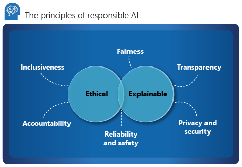
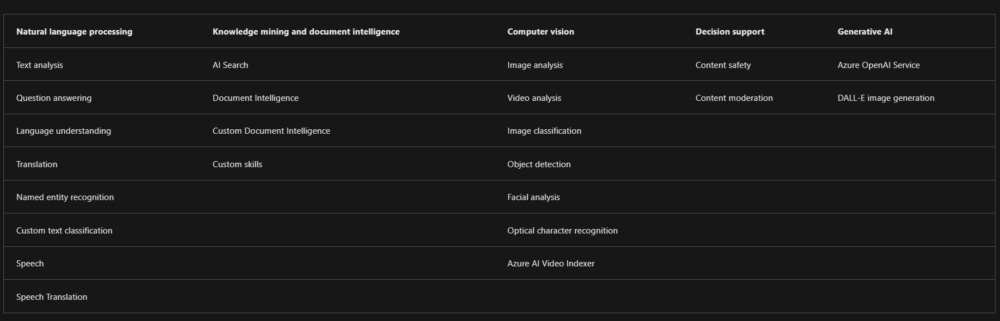

# Introduction

Start a journey to become an AI Engineer

Artificial intelligence (AI) engineers are responsible for developing, programming and training the complex networks of algorithms that make up AI so that they can function like a human brain. This role requires combined expertise in software development, programming, data science and data engineering. Though this career is related to data engineering, AI engineers are rarely required to write the code that develops scalable data sharing. Instead, artificial intelligence developers locate and pull data from a variety of sources, create, develop and test machine learning models and then utilize application program interface (API) calls or embedded code to build and implement AI applications.

As an aspiring Azure AI Engineer, you should understand core concepts and principles of AI development, and the capabilities of Azure services used in AI solutions.

# Understand considerations for AI Engineers

Increasingly, software solutions include AI features; so software engineers need to know how to integrate AI capabilities into their applications and services.

**Model training and inferencing**

Many AI systems rely on predictive models that must be trained using sample data. The training process analyzes the data and determines relationships between the features in the data (the data values that will generally be present in new observations) and the label (the value that the model is being trained to predict).

After the model has been trained, you can submit new data that includes known feature values and have the model predict the most likely label. Using the model to make predictions is referred to as *inferencing*.

**Probability and confidence scores**

A well-trained machine learning model can be accurate, but no predictive model is infallible. The predictions made by machine learning models are based on *probability*, and while software engineers don't require a deep mathematical understanding of probability theory, it's important to understand that predictions reflect statistical likelihood, not absolute truth. In most cases, predictions have an associated *confidence score* that reflects the probability on which the prediction is being made.

# Understand considerations for responsible AI

**Fairness**

AI systems should treat all people fairly. For example, suppose you create a machine learning model to support a loan approval application for a bank. The model should make predictions of whether or not the loan should be approved without incorporating any bias based on gender, ethnicity, or other factors that might result in an unfair advantage or disadvantage to specific groups of applicants.

**Reliability and safety**

.png)

For AI systems to be trusted, they need to be reliable and safe. It's important for a system to perform as it was originally designed and to respond safely to new situations. Its inherent resilience should resist intended or unintended manipulation.

**Privacy and security**

AI systems should be secure and respect privacy. The machine learning models on which AI systems are based rely on large volumes of data, which may contain personal details that must be kept private.

**Inclusiveness**

AI systems should empower everyone and engage people.

**Transparency**

AI systems should be understandable. Users should be make fully aware of the purpose of the system., how it works, and what limitations may be expected. 

**Accountability**

People should be accountable for AI systems. Although many AI systems seem to operate autonomously, ultimately it's the responsibility of the developers who trained and validated the models they use, and defined the logic that bases decisions on model predictions to ensure that the overall system meets responsibility requirements. 

# Understand capabilities of Azure Machine Learning

Azure Machine Learning provides the following features and capabilities:

**Automated machine learning**:	This feature enables non-experts to quickly create an effective machine learning model from data.

**Azure Machine Learning designer**: A graphical interface enabling no-code development of machine learning solutions.

**Data and compute management**: Cloud-based data storage and compute resources that professional data scientists can use to run data experiment code at scale.

**Pipelines**: Data scientists, software engineers, and IT operations professionals can define pipelines to orchestrate model training, deployment, and management tasks.

Data scientists can use Azure Machine Learning throughout the entire machine learning lifecycle to:

- Ingest and prepare data.

- Run experiments to explore data and train predictive models.

- Deploy and manage trained models as web services.

Software engineers may interact with Azure Machine Learning in the following ways:

- Using Automated Machine Learning or Azure Machine Learning designer to train machine learning models and deploy them as services that can be integrated into AI-enabled applications.

- Collaborating with data scientists to deploy models based on common frameworks such as Scikit-Learn, PyTorch, and TensorFlow as web services, and consume them in applications.

- Using Azure Machine Learning SDKs or command-line interface (CLI) scripts to orchestrate DevOps processes that manage versioning, deployment, and testing of machine learning models as part of an overall application delivery solution.

# Understand capabilities of Azure AI Services

Azure AI Services are cloud-based services that encapsulate AI capabilities. Rather than a single product, you should think of Azure AI Services as a set of individual services that you can use as building blocks to compose sophisticated, intelligent applications.

Azure AI services offer a wide range of prebuilt AI capabilities across multiple categories, with examples shown in the following table.

