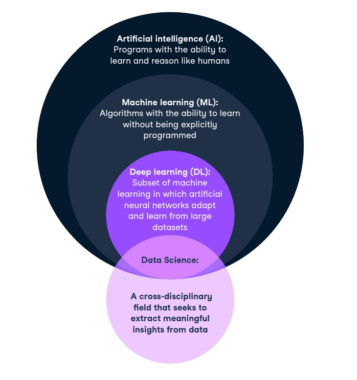

# What is AI
AI, Artificial Intelligence is a branch of computer science focused on creating systems that can perform tasks that would require human intelligence. These tasks range from understanding natural language, making decisions, and learning from experience.

## Different Types of Artificial Intelligence
- **Artificial Narrow Intelligence (ANI)**: This is the most common form of AI we interact with today. ANI is designed to perform a single task, like voice recognition or recommendations on streaming services.

- **Artificial General Intelligence (AGI)**: An AI with AGI possesses the ability to understand, learn, adapt, and implement knowledge across a wide range of tasks at a human level.

- **Artificial Super Intelligence (ASI)**: The final level of AI, ASI, refers to a future scenario where AI surpasses human intelligence in nearly all economically valuable work. This concept, while intriguing, remains largely speculative.

## Artificial Intelligence, Machine learning, Deep Learning and Data Science
- **Artificial Intelligence (AI)**: AI is the broader concept that aims to create intelligent machines that can simulate human intelligence and perform tasks that typically require human intelligence.

- **Machine Learning (ML)**: Machine Learning is a subset of AI that focuses on developing algorithms that enable computers to learn from data and make predictions or decisions without being explicitly programmed.

- **Deep Learning**: Deep Learning is a subset of ML that specifically focuses on artificial neural networks. It involves building and training neural networks with multiple layers (hence the term "deep") to learn and represent complex patterns and relationships within data.

- **Data science** is a cross-disciplinary field that uses all of the above, amongst other skills like data analysis, statistics, data visualization, and more, to get insight from data.

## Learning

From Microsoft: https://microsoft.github.io/AI-For-Beginners/

