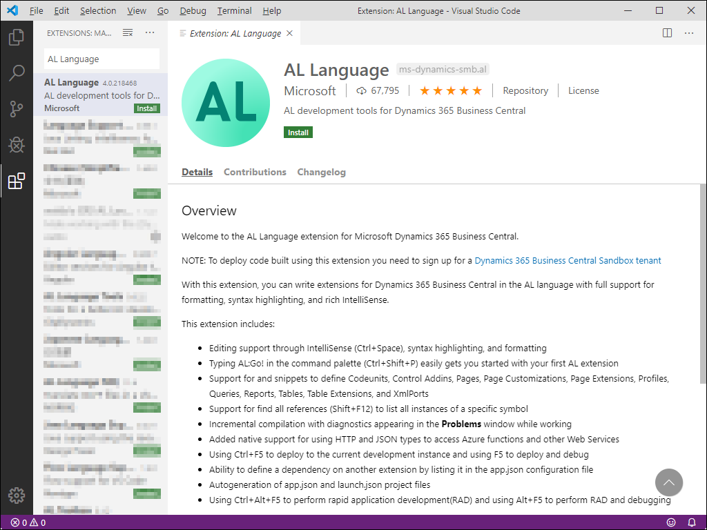

# Get started with Visual Studio Code
## Install Visual Studio Code

Microsoft uses Visual Studio Code as the development environment for Business Central. Visual Studio Code was launched in April 2015 and is a free and open-source code editor. Visual Studio Code is different from the code editor Visual Studio, which is used for creating, building, and deploying large Microsoft .NET solutions.

Visual Studio Code can be installed on Windows, Linux, and macOS. You can download and install [Download here](https://code.visualstudio.com/Download)

## Install the AL language extension in Visual Studio Code

When you develop applications for Microsoft Dynamics 365 Business Central with Visual Studio Code, you must install the application language extension. The easiest way to install the extension is through the Visual Studio Code Marketplace.

1. Select the Extensions tab, which is the fifth tab on the Activity Bar on the left side of the Visual Studio Code application, or you can use the **Ctrl+Shift+X** keyboard shortcut.

2. Enter AL Language in the Search Extensions in Marketplace field.

3. Select the green Install button to install the AL Language Extension.

 

4.	Create new extension from Visual Studio Code.
Press the **Ctrl + Shift + P** shortcut key, select **AL:Go!** (or press the Alt+A, Alt+L).

Choose the path to a new empty folder and select version to run.

Then choose Microsoft cloud sandbox as the server.

Enter credentials

Download symbols

5.	Build and deploy extension to Business Central.
Press **Ctrl+F5** to build and deploy extension to Business Central.

