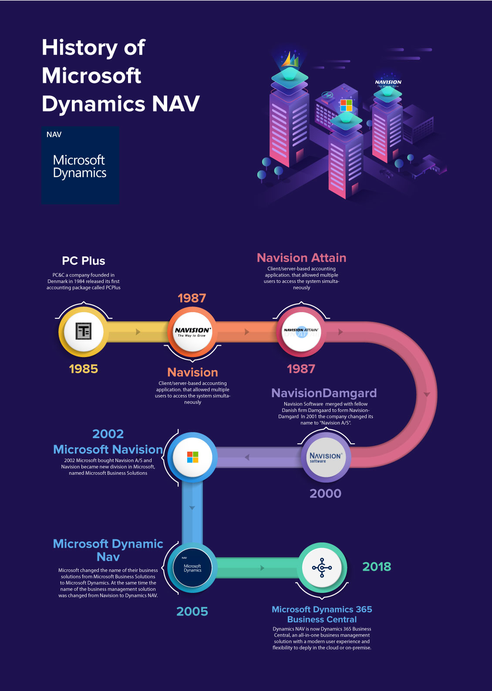

# From Navision to Microsoft Dynamics 365 Business Central

Navision, a Danish software company founded in 1984, created an ERP (Enterprise Resource Planning) solution known as Navision Financials. This platform offered comprehensive financial and operational management for businesses. Over time, Navision evolved its product lineup, incorporating functionalities beyond finance, like supply chain management and CRM, becoming known as Navision Attain.

In 2002, Microsoft acquired Navision and merged it with another acquired ERP solution, Great Plains Software, to form Microsoft Business Solutions. This merger resulted in the birth of Microsoft Dynamics NAV, combining the strengths of Navision and Great Plains.

The Dynamics NAV platform continued to evolve, incorporating enhancements, features, and improved integrations. Microsoft's aim was to streamline business processes, enhance user experience, and expand the capabilities of the software.

Fast forward to 2018 when Microsoft rebranded and launched Dynamics 365 Business Central. It marked a significant shift as Business Central became a part of the Dynamics 365 suite, offering a cloud-based, all-in-one ERP solution designed for small to medium-sized businesses. While it's based on the foundation of Dynamics NAV, Business Central offers modernized features, improved user interfaces, and cloud-based accessibility, aligning with Microsoft's vision for a connected and agile business ecosystem.

