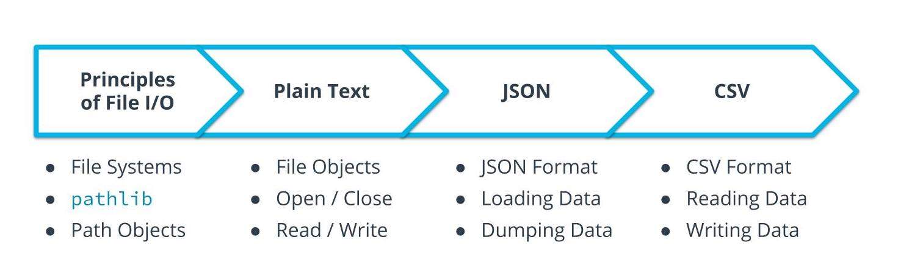
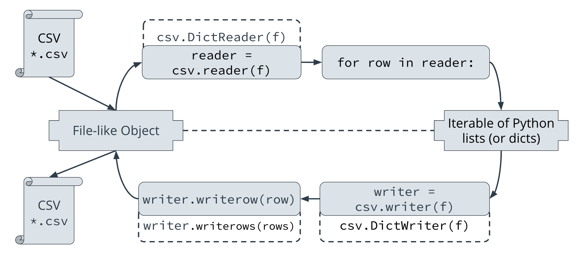

# File I/O

## What we're doing

- Principles of File I/O: File systems; the pathlib module; and Path-like objects

- Plain Text: What are file-like objects; how to responsibly open (and close) files; and how to read data from and write data to external files

- JSON: What is JSON; loading JSON data from a file into Python; dumping data from Python into a file

- CSV: What is CSV; reading CSV data from a file into Python; writing data from Python to a file.




## File Systmes and Paths


```python
from pathlib import Path
here = Path('.')
here = here.resolve()
parent = here.parent
print(parent)
print(here)
```

## open() function
In Python, the open() function serves as the primary method for file handling. It allows you to open files in various modes (such as read, write, append, etc.) and perform operations on them. Here's a breakdown of the open() function and its common usage:

`open(file, mode='r', buffering=-1, encoding=None, errors=None, newline=None, ...)`

**Parameters:**

-   `file`: The path or name of the file to be opened.
-   `mode`: Specifies the mode in which the file is opened (`'r'` for reading, `'w'` for writing, `'a'` for appending, `'rb'` for reading in binary mode, etc.).
-   `buffering`: Optional parameter for setting the buffering policy.
-   `encoding`: Optional parameter specifying the file's encoding.
-   `errors`: Optional parameter specifying how encoding/decoding errors are handled.
-   `newline`: Optional parameter for handling newline characters.

**Common Modes:**

-   `'r'`: Opens the file for reading (default mode).
-   `'w'`: Opens the file for writing, truncating the file first.
-   `'a'`: Opens the file for appending.
-   `'rb'`, `'wb'`, `'ab'`: Modes for reading, writing, or appending in binary format.

## Plain Text
Python offers simple yet powerful functions for working with plain text files. The `open()` function is the gateway to file manipulation.


```python
# Writing to a text file
with open("sample.txt",'w') as file:
    file.write("Hello World")

# Reading from a text file
with open("sample.txt",'r') as file:
    content = file.read()
    print(content)
```

## CSV
CSV stands for Comma-Seperate Values. It can be thought of as an Excel spreadsheet, with row representing objects and columns representing attributes.




```python
import csv

# Writting to CSV file
data = [
    ['Name', 'Age', 'Email'],
    ['Alice', 25, 'alice@example.com'],
    ['Bob', 30, 'bob@example.com']
]

with open("sample.csv",'w') as file:
    csv_writer = csv.writer(file)
    csv_writer.writerows(data)

# Reading from CSV file
with open("sample.csv",'r') as file:
    reader = csv.reader(file)
    next(reader)
    for row in reader:
        print(row)
    
```

## JSON
JSON (JavaScript Object Notation) is widely used for data interchange


```python
import json

data = {
    'name': 'John Doe',
    'age': 35,
    'email': 'john@example.com'
}

# Writing to a JSON file
with open("sample.json",'w') as file:
    json.dump(data, file)

# Reading from a JSON file
with open("sample.json",'r') as file:
    data = json.load(file)
    print(data)
    
```

## Using Pandas
Pandas, a powerful library in Python, simplifies data manipulation tasks, especially when working with tabular data.


```python
import pandas as pd

# Reading from CSV using Pandas
data_frame = pd.read_csv('data.csv')
print(data_frame)

# Writing to CSV using Pandas
data_frame.to_csv('new_pandas_data.csv', index=False)

# Reading from JSON using Pandas
data_frame = pd.read_json('data.json')
print(data_frame)

# Writing to JSON using Pandas
data_frame.to_json('new_pandas_data.json', orient='records')
```


