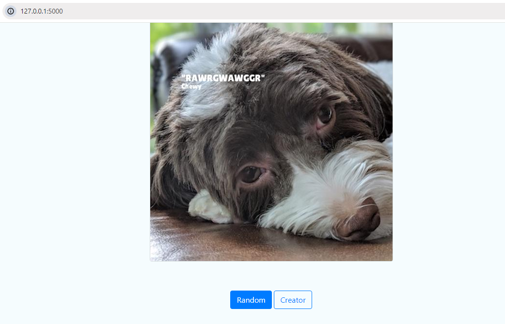

# Project: Meme Generator

The project for this course is a meme generator, an application you'll write in Python that will pair random images with random quotes.

Source Code: https://github.com/quanglenhutthanh/Udacity-Projects/tree/main/Intermediate%20Python/Near-Earth_Project

## Overview

The goal of this project is to build a "meme generator" – a multimedia application to dynamically generate memes, including an image with an overlaid quote. It's not that simple though! Your content team spent countless hours writing quotes in a variety of filetypes. You could manually copy and paste these quotes into one standard format – but you're going to over-engineer a solution to load quotes from each file to show off your fancy new Python skills.

The application you build must:

- Interact with a variety of complex filetypes. This emulates the kind of data you'll encounter in a data engineering role.
- Load quotes from a variety of filetypes (PDF, Word Documents, CSVs, Text files).
- Load, manipulate, and save images.
- Accept dynamic user input through a command-line tool and a web service. This emulates the kind of work you'll encounter as a full stack developer.

This project will give you a hands-on opportunity to practice what you've learned in this course, such as:

- Object-oriented thinking in Python, including abstract classes, class methods, and static methods.
- DRY (don't repeat yourself) principles of class and method design.
- Working with modules and packages in Python.

## Description

### Quote Engine

The `Quote Engine` module is responsible for ingesting many types of files that contain quotes. For our purposes, a quote contains a body and an author:

```

"This is a quote body" – Author

```

This module will be composed of many classes and will demonstrate your understanding of complex inheritance, abstract classes, classmethods, strategy objects and other fundamental programming principles.

**Ingestors**

An abstract base class, `IngestorInterface` should define two methods with the following class method signatures:

```

def can\_ingest(cls, path: str) -\> boolean

def parse(cls, path: str) -\> List[QuoteModel]

```

Separate strategy objects should realize IngestorInterface for each file type (csv, docx, pdf, txt).

A final `Ingestor` class should realize the `IngestorInterface` abstract base class and encapsulate your helper classes. It should implement logic to select the appropriate helper for a given file based on filetype.

### Meme Engine

The Meme Engine Module is responsible for manipulating and drawing text onto images. It will reinforce your understanding of object-oriented thinking while demonstrating your skill using a more advanced third party library for image manipulation.

## Getting Started

### Prerequisites

Install the `python-docx` library.

Install xpdfreader.

Install the `Pillow` library to perform basic image operations.

### Install

Install all dependencies given in the requirements.txt file using pip:

```

pip install -r requirements.txt

```

Download and install pdftotext: https://www.xpdfreader.com/download.html

  - Unzip the files in a location of your choice.
  - Get the full file path to the folder named bin32 (if you have a 32-bit machine) or bin64 (if you have a 64-bit machine).
  - Add this path to the Path environment variable. This will allow you to use the xpdf command from the command line. If you've never done this before, check out:https://stackoverflow.com/questions/44272416/how-to-add-a-folder-to-path-environment-variable-in-windows-10-with-screenshot

The application can be started by running the following command:

```

python app.py

```


