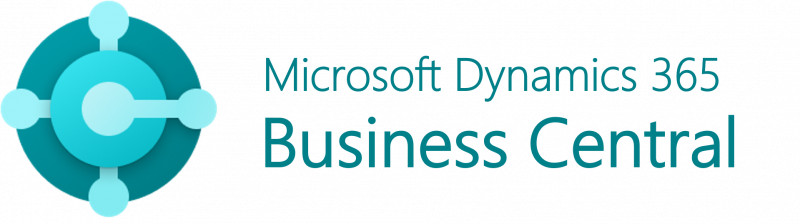

# About me

With 8 years of experience in software development, my journey in the tech world has been deeply intertwined with Microsoft Dynamics 365 Business Central and Dynamics NAV. Over the years, I've honed my skills as a Technical Consultant, gaining in-depth knowledge and hands-on experience in various aspects of ERP systems, particularly in Distribution Management Systems (DMS).

 
            

### Expertise in ERP and DMS Solutions

My career has been centered around ERP systems, with a strong focus on implementing DMS solutions. I have had the privilege of working on numerous real-world projects, collaborating directly with customers to tailor Microsoft Dynamics 365 Business Central and Dynamics NAV to meet their unique business needs. This experience has not only deepened my understanding of ERP systems but has also equipped me with the expertise to deliver solutions that drive efficiency and productivity. Notably, I have successfully released projects for major customers in the Fast-Moving Consumer Goods (FMCG) domain in Vietnam, further solidifying my ability to deliver impactful results in demanding industries.

### Production Support and Maintenance

Beyond implementation, I have also been involved in the critical phase of production support and maintenance. Ensuring that the systems we deploy run smoothly and efficiently is a responsibility I take seriously. My role involves troubleshooting, optimizing performance, and ensuring that the solutions we deliver continue to meet the evolving needs of our clients.

### System Integration Expertise

In today’s interconnected business environment, integration between different systems is key. I have developed strong skills in integrating systems through various methods, such as APIs and file-based exchanges. This expertise has been applied in many successful projects, enabling seamless data flow and communication between diverse systems, which is crucial for the overall success of any ERP solution.

### Leadership in Project Delivery

In addition to my technical expertise, I have also taken on the role of managing technical teams. Leading a team to deliver projects on time and within scope is a challenge I embrace. My experience in project management ensures that our projects not only meet technical requirements but are also delivered with the highest standards of quality and timeliness.

### Expanding into AI and ML
Recognizing the growing importance of artificial intelligence and machine learning in the technology landscape, I have embarked on a dedicated learning journey to expand my expertise in these areas. I am actively exploring how AI and ML can be integrated into ERP systems to enhance automation, decision-making, and overall business intelligence. This new direction complements my existing skill set, positioning me to contribute to innovative solutions in the ever-evolving field of technology.

# How I create this page

I've chosen **Docusaurus** to build my website specifically for documentation purposes. Docusaurus is an open-source tool tailored for creating and managing documentation websites. Its user-friendly interface allows for swift and straightforward site creation. You can easily and quickly set up your site by following the instructions outlined here: https://docusaurus.io/docs.

I use **GitHub Pages** to host my site, which can be found at https://pages.github.com/. It is a free static site hosting service.

I also employ **CI/CD** through **GitHub Actions** to enable automatic deployment and build processes. This involves creating a GitHub repository to store the source code of my site, and setting up a GitHub Action that automates the build and deployment whenever I push new code to the repository, you can refer [here.](https://jamesiv.es/blog/github/actions/2022/01/23/deploying-to-github-pages-with-github-actions?fbclid=IwAR1ZuG8lXjF32VS7SDV24eRoqoYeBlPtOuF_cPzDpRc1X1dhgOks5WmF91k)
